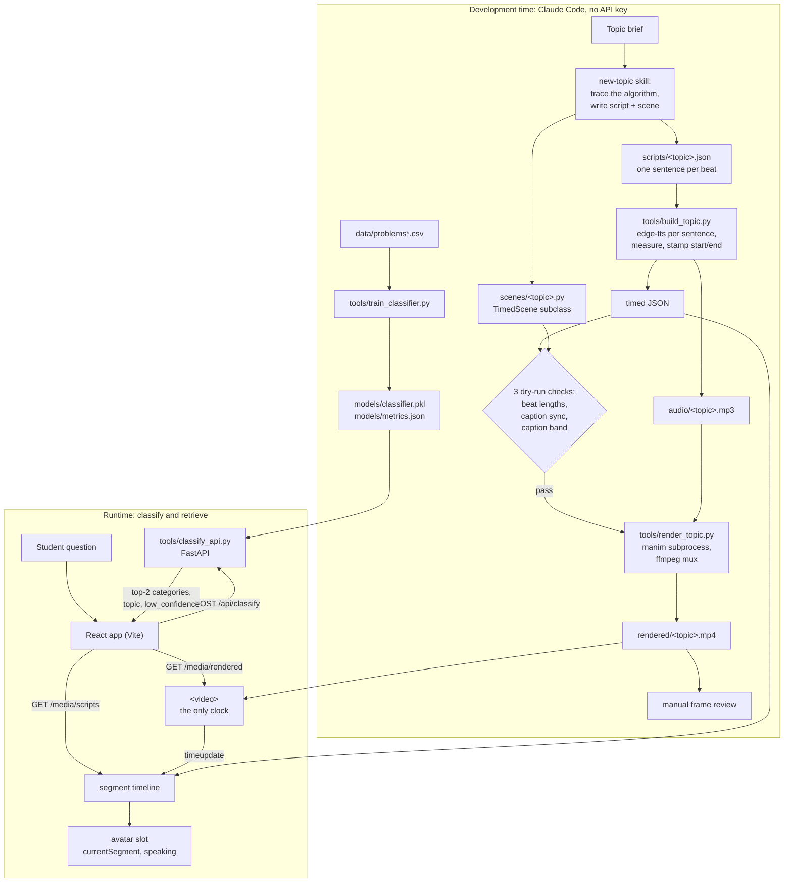

# AI Teacher

Narrated, animated explanations of six topics, and a web app that routes a
student's question to the right one.

Every video is written, voiced, timed, checked and rendered at **development
time**. At **runtime** the app does only two things: classify the question and
play a video that already exists. The full write-up, with measurements and
limitations, is in [REPORT.md](REPORT.md).

| Topic | Classifier category | Beats | Length |
|---|---|---:|---:|
| `bubble_sort` | sorting | 35 | 149.8 s |
| `binary_search` | searching | 28 | 128.7 s |
| `kadane` | dynamic_programming | 27 | 126.4 s |
| `valid_parentheses` | stack | 26 | 117.7 s |
| `euclidean_gcd` | math | 26 | 118.5 s |
| `projectile_motion` | physics | 27 | 123.4 s |

All six videos are 1920×1080 at 30 fps (H.264 + AAC), and all six pass the three
pipeline checks.

## Architecture



The two halves are separate on purpose. There is no LLM API key to generate
anything at runtime. A render takes minutes. And generated scene code has to pass
the checks and a look at real frames before anyone sees it. See
[REPORT.md §2](REPORT.md#2-architecture).

## Running the demo

Requirements: Python 3.12, Node 24 (tested), Windows. Keep the project on one
drive: Manim's `media_dir` (set in `manim.cfg`) must be on the same drive as the
project, or LaTeX/dvisvgm fails. A LaTeX distribution is needed to **build or
render** videos (the checks compile every `MathTex`), not to run the demo.

```powershell
uv venv .venv --python 3.12
uv pip install --python .venv\Scripts\python.exe -r requirements.txt
cd frontend; npm install; cd ..
```

Run these in two terminals, from the project root:

```powershell
.venv\Scripts\python.exe tools\classify_api.py      # http://127.0.0.1:8000, ~20 s to load the model
```

```powershell
cd frontend; npm run dev                             # http://localhost:5173
```

The service starts offline and reads the embedding model from
`.cache/huggingface/`. On a fresh clone that cache is empty, so run the first
start with `$env:HF_HUB_OFFLINE=0` to download the model once.

If the classifier service is down, the app says so and the topics in the
sidebar still play.

## Building a topic

```powershell
.venv\Scripts\python.exe tools\build_topic.py  <topic>              # TTS, timings, all three checks
.venv\Scripts\python.exe tools\render_topic.py <topic> --title "<Title>" --category <category> --quality h  # render, mux, list
```

`render_topic.py` ends by listing the topic in `rendered/manifest.json`, under a
sidebar title and a classifier category. That file is the only topic list: the
app's sidebar and `/classify` both read it on every request and skip entries whose
video or script is missing. A newly rendered topic therefore appears on refresh,
with no code change and no restart. `--title` and `--category` are required on a
topic's first render, and remembered after. To list a topic that is already
rendered without rendering it again, run `tools\topic_manifest.py <topic> --title
"<Title>" --category <category>`.

`build_topic.py` reads `scripts/<topic>.json` (`[{id, text, beat}]`). It
synthesises one clip per sentence, writes the measured `start`/`end` back into the
JSON, and exits non-zero if any check fails. The audio is always written first,
so a failed check never wastes the TTS run. Render only once it exits 0. The
full procedure, including the rules that make the checks pass, is in
[.claude/skills/new-topic/SKILL.md](.claude/skills/new-topic/SKILL.md).

Checks confirm timing and caption text, not layout. Always look at frames from
a new video before calling it done.

## Retraining the classifier

```powershell
.venv\Scripts\python.exe tools\train_classifier.py
```

This reproduces all three recorded runs (v1 9-class TF-IDF, v2 6-class TF-IDF,
v2 6-class embeddings) with seed 42. It writes `models/metrics.json`,
`models/confusion_matrix.png`, and `models/classifier.pkl` (the best v2 model).

## Results, briefly

- **Classifier:** 54.2% top-1 and 74.0% top-2 accuracy on 131 held-out
  problems across 6 classes. That is barely different from the 56.25% of the
  original 9-class baseline: the ceiling comes from the labels, not the model.
  Physics scores 100%, largely because its rows are four times shorter than the
  rest; the five LeetCode classes average 45%.
- **Low confidence:** a best score below 0.40 is flagged, and the app says
  there's no explanation for that question yet and shows the closest topic. So
  is any mention of linked lists, graphs, trees, BFS/DFS, hash maps or two sum,
  whatever the score.
- **Timing:** every beat is 3.6 to 5.5 s. Each scene's dry run matches its
  narration length to the millisecond. The rendered video runs 0.05 to 0.42 s
  longer than the audio before muxing trims it.

## Limitations

Stated plainly, with evidence, in [REPORT.md §7](REPORT.md#7-limitations):

- the single-label ceiling
- the physics length confound
- linked-list questions leaking into stack
- mux drift
- no containerised sandbox
- the avatar is only a placeholder (its service was blocked by campus DNS)
- retrieval covers only six topics

## Layout

```
scenes/      TimedScene base (beat_timing.py) + one scene per topic
scripts/     timed narration JSON, one per topic: [{id, text, start, end, beat}]
audio/       per-sentence clips (content-keyed cache) + concatenated master
rendered/    final muxed videos + manifest.json (the topic list: title, category)
tools/       build_topic, render_topic, topic_manifest, build_dataset,
             train_classifier, sentence_embedder, classify_api
data/        problems.csv (v2, 6 classes), problems_v1_9class.csv, problems_v2_6class.csv
models/      classifier.pkl, metrics.json (all runs), confusion_matrix.png
frontend/    Vite + React app
```

## Prior art

The Leap repository was studied as prior art.
<!-- TODO: add the Leap repository URL. -->
