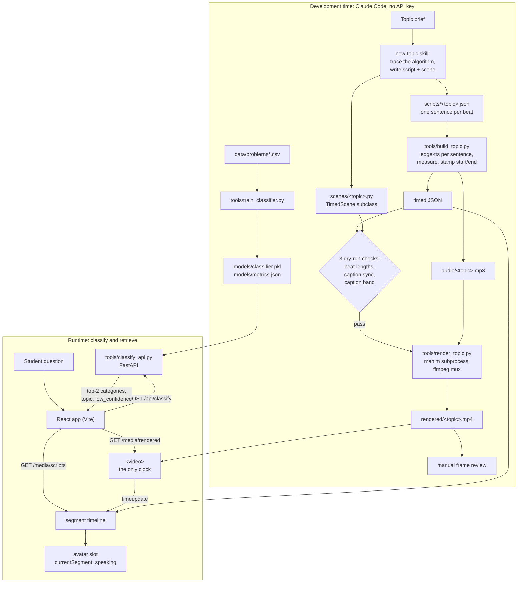
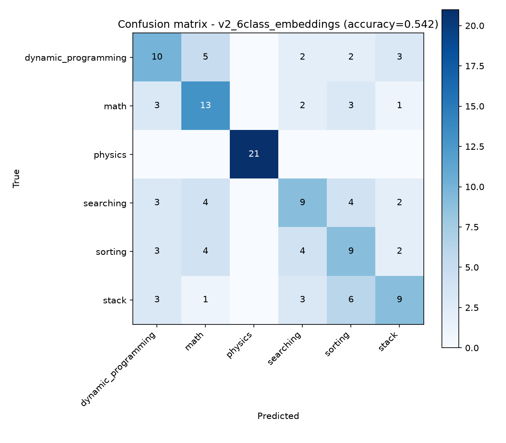

# AI Teacher — Project Report

## 1. Summary

AI Teacher pairs six narrated, animated explanation videos with a web app
that routes a student's free-text question to one of them.

- **Content.** Six topics: bubble sort, binary search, Kadane's algorithm,
  valid parentheses, the Euclidean GCD and projectile motion. That is 169
  narrated beats and 764.5 s of video, each generated as a Manim scene
  locked to measured text-to-speech timings. All six pass the three
  automated checks described in §4.
- **Routing.** A sentence-embedding + logistic-regression classifier behind a
  FastAPI service. On 131 held-out problems it is right **54.2%** of the time
  (top-1) and **74.0%** of the time counting its second guess (top-2). A
  confidence threshold and a keyword guard stop it presenting weak or
  impossible matches as answers.
- **App.** A Vite + React page where the `<video>` element is the only
  clock, the six topics are always clickable, and a slot for a talking avatar
  already receives the active narration segment.

The 54% is the most important number in this report. §6 explains why it is
low and why more modelling did not raise it.

## 2. Architecture



### 2.1 Development time: agentic generation

Topics are produced in a Claude Code session that follows the `new-topic`
skill ([.claude/skills/new-topic/SKILL.md](.claude/skills/new-topic/SKILL.md)).
The agent works through these steps:

1. **Trace the algorithm on the exact input before writing any narration.**
   This step exists because of a real near-miss. Binary search for 7 in
   `[1, 3, 4, 7, 9, 12, 15, 18]`, using the textbook `mid = (lo+hi)//2` on
   inclusive bounds, finds the target on the very first probe. That leaves
   nothing to halve and nothing to animate. Tracing first caught it; the fix was
   half-open `[lo, hi)`, which gives three probes and a window shrinking 8 → 4 → 1.
2. **Write `scripts/<topic>.json`**, one sentence per beat.
3. **Write `scenes/<topic>.py`**, a `TimedScene` subclass that pairs each beat
   with exactly one animation.
4. **Run `tools/build_topic.py`.** It synthesises the audio, measures it,
   writes the timings, and runs the three checks.
5. **Run `tools/render_topic.py`.** It renders the scene, muxes in the narration
   and publishes the video.
6. **Pull frames from the finished video and look at them.**

The classifier is trained in this half too (`tools/train_classifier.py`).

### 2.2 Runtime: classify and retrieve

The browser posts the question to `/api/classify`. Vite proxies that to
`tools/classify_api.py`, which returns the top two categories with their scores,
a topic that has a rendered video, and a `low_confidence` flag. The app then
plays `rendered/<topic>.mp4` and loads `scripts/<topic>.json` to know which
narration segment is on screen. Nothing is generated at runtime.

### 2.3 Why they are separate

- **No runtime generator.** There is no LLM API key; all generation happened
  during development.
- **Cost and latency.** Producing a topic needs network TTS, LaTeX compilation
  and a 1080p Manim render. The render timeout is set to an hour, with the note
  that a render is "minutes, not hours". A request cannot wait for that.
- **Generated code needs review.** Every visual defect so far was invisible to
  the automated checks and was found by looking at frames. That review cannot
  happen per request.
- **No sandbox.** The development machine has no Docker or WSL. Running
  freshly generated scene code on demand would mean executing unreviewed code
  unisolated (§7.5).
- **A simpler runtime.** Runtime becomes small and predictable. Its failure
  modes are a wrong or low-confidence match, which the sidebar can correct, and
  the service being down, which the app reports without breaking playback.

## 3. The timing contract

The contract has one rule. **Every visible change is derived from measured
narration, and the video is the only clock.** It is enforced at four stages,
from script to browser.

### 3.1 Sentence-level beats

A beat is one narration sentence, one visible action, and that sentence as its
caption. The target is 3–6 s per beat, which the skill gets by writing 9–13
words per sentence for the voice used (en-US-AriaNeural, about 150 words per
minute). Coarser beats were tried first. A 20 s caption covers three or four
actions, so a video "feels" out of sync even when its timestamps line up
([scenes/beat_timing.py](scenes/beat_timing.py)).

Measured result across all 169 beats: **every slot falls between 3.64 s and
5.53 s**.

### 3.2 Measured TTS durations

`build_topic.py` synthesises one mp3 per sentence and reads each clip's real
duration. It then lays the sentences out on one timeline:

```
start[i] = end[i-1] + gap        gap = 0.35 s of silence
end[i]   = start[i] + measured duration of clip i
slot[i]  = start[i+1] - start[i] (the silence belongs to the beat it follows)
```

It writes `start`/`end` back into the JSON and concatenates the clips, with the
same gaps, into `audio/<topic>.mp3`. The master's length therefore equals the
last segment's `end` exactly.

Clips are cached by content. A sidecar file stores the exact voice and text that
produced each clip. An existence-only cache would keep old audio after a sentence
was edited, and would measure timings off the wrong clip while every check still
passed.

### 3.3 Durations drive Manim `run_time`s

No `run_time` is written by hand.

- **Slots.** `TimedScene.beat(name)` gives the block a `BeatClock` holding that
  beat's slot.
- **Caption first.** It writes the caption as the block's first animation
  (15% of the slot, capped at 0.9 s), so the caption changes the instant the
  sentence starts.
- **Actions.** An action asks for a fraction of the slot (typically 40%) with a
  cap. Time a cap refuses carries forward into the next pause rather than being
  lost.
- **Fill.** `finish()` holds whatever is left, so every beat fills its slot
  exactly.

As a result, each scene's total length equals its narration length. The dry run
confirms this to the millisecond for all six topics (§4.4).

### 3.4 The video is the single source of truth

The app keeps no timer of its own.

- **Mapping.** On `timeupdate`/`seeking`/`seeked` it reads
  `video.currentTime` and binary-searches the same `start` values from the
  JSON.
- **Exposed state.** `currentSegment` stays on the most recently started
  segment through the 0.35 s gaps; `speaking` is true only within
  `[start, end]`. Both are passed to the avatar slot.
- **Robustness.** Pausing, seeking, buffering and switching topics therefore
  cannot desynchronise the page from the picture. A result loaded for one topic
  is never mapped against another topic's video.
- **No caption bar.** Captions are burned into the video, so the page draws
  none.

## 4. The three checks

`build_topic.py` runs all three after the audio is written. None of them
renders anything. Caption sync and caption band **dry-run** the scene: they
load it with `play()`/`wait()` replaced by no-ops, so the beat clock still
counts every `run_time` and every object is still constructed, but no frames
are drawn.

### 4.1 Beat lengths (`report_beat_lengths`)

- **Catches:** any beat outside 3–6 s, meaning a sentence too long to tie to
  one action or too clipped to read.
- **Misses:** everything visual.
- **Prompted by:** paragraph-level beats. Long captions spanning several actions
  felt out of sync despite correct timestamps. Added alongside the
  sentence-level contract with binary search (commit `41593d0`).

### 4.2 Caption sync (`check_caption_sync`)

- **Catches:**
  - a beat whose first caption change differs from its narration `start` by
    more than 0.05 s;
  - a beat with no caption at all;
  - a scene whose total length differs from the narration.

  Because the dry run constructs every object, it also surfaces `MathTex`
  syntax errors and missing attributes before a render is spent.
- **Misses:** what a caption *says*.
- **Prompted by:** the bubble sort caption rule recorded in
  [CLAUDE.md](CLAUDE.md). Segment 5 must open with "one more comparison: nine
  against seven", not "the largest has bubbled to the end", because the 9 has
  not moved yet. Added with bubble sort (commit `8fc4df4`), together with
  caption-first beats. The fix has two halves:
  - **timing:** the caption must change when the sentence starts. This check
    enforces it.
  - **content:** a caption must not claim something not yet shown. That is a
    writing rule; **no check verifies it.**

### 4.3 Caption band (`check_caption_band`)

- **Catches:** any scene object (anything held in `self.<name>`) that sits
  within 0.65 scene units of the caption **and** says the same thing. Text is
  normalised for case, whitespace and LaTeX markup before comparing.
- **Misses:** a *different* object overlapping the caption, and layout in
  general.
- **Prompted by:** a collision in the Euclidean GCD video. The caption
  "O(log n)" and a separate `O(\log n)` formula sat 0.55 units apart; they did
  not overlap, yet read as the same text drawn twice. Fixed and added in commit
  `19a8e41`.
- **Designs rejected on the way:**
  - Inspecting Manim's animation internals gave about 80 false positives.
  - Distance alone flagged verified-clean beats: Kadane's "sum = 6" label sits
    0.06 units from an unrelated caption. So a finding needs proximity *and*
    matching text.
- **Known miss:** `\frac{48}{18}` and "48 / 18" do not normalise equal. This is
  documented in the code, not silent.

### 4.4 Current results

Rendered length is the silent Manim render's duration; drift is how much longer
it runs than the narration audio.

| Topic | Beats | Narration | Beat range | Lengths | Sync | Band | Dry-run vs audio | Rendered length vs audio |
|---|---:|---:|---|:-:|:-:|:-:|---:|---:|
| binary_search | 28 | 128.73 s | 3.78–5.13 s | pass | pass | pass | 0.000 s | +0.236 s |
| bubble_sort | 35 | 149.78 s | 3.64–4.99 s | pass | pass | pass | 0.000 s | +0.417 s |
| euclidean_gcd | 26 | 118.48 s | 3.69–5.34 s | pass | pass | pass | 0.000 s | +0.354 s |
| kadane | 27 | 126.41 s | 3.69–5.29 s | pass | pass | pass | 0.000 s | +0.053 s |
| projectile_motion | 27 | 123.44 s | 3.66–5.53 s | pass | pass | pass | 0.000 s | +0.395 s |
| valid_parentheses | 26 | 117.66 s | 3.89–5.20 s | pass | pass | pass | 0.000 s | +0.304 s |

The last column is the mux drift discussed in §7.4. The checks cannot see it,
because a dry run never quantises to frames.

### 4.5 What the checks cannot see

The checks verify timing and text, not layout. A scene can pass all three and
still look wrong. Frame review found every visual defect so far: a label
colliding with the title, and a swap arc crossing a brace.

The same held for the web app. A scan of every 3 s of all six videos found that
a 220 px avatar box in the bottom-left of the frame would cover content in the
bottom caption band in 46% of frames, and animation above it in 56%. As a result, the avatar was
moved out of the frame into the sidebar.

## 5. The web app

- **Stack.** Vite + React with plain CSS. `rendered/` and `scripts/` are served
  in place, with byte-range support so the video can seek.
- **Layout.** The video fills the available height, with the six topics always
  visible in a sidebar. The avatar slot sits at the top of the sidebar and
  receives `currentSegment` and `speaking`.
- **Classification readout.** Above the video: the query, the predicted
  category and score, the matched topic, and a clickable runner-up. It never
  grows past the title's height, so a result arriving never moves the video.
- **Low confidence.** The readout says plainly that there is no explanation for
  the question yet, and names the closest available topic. That topic loads
  but does not autoplay.
- **Late results.** An answer arriving after a newer question, or after the
  student has picked a topic by hand, is discarded.
- **Service down.** The proxy returns 502 within milliseconds. The app says the
  classifier isn't reachable and keeps playing the current topic.

## 6. Classifier

### 6.1 v1: nine classes from a single-label mapping

`tools/build_dataset.py` built the first dataset from a public LeetCode scrape.
LeetCode tags problems with *several* topics, and the dataset needed *one*
label, so the script applied the first matching rule in a fixed priority order:
linked list, stack, binary search, graph, dynamic programming,
two-pointers/sliding-window/prefix-sum, sorting, math, and finally the generic
"Array" tag. Each problem kept only the first match. Physics rows were written by
hand, because LeetCode has no physics.

The result: 400 rows, 9 classes, 45 per class (linked_list 40).

**Baseline.** TF-IDF + logistic regression with default settings, a stratified
80/20 split and seed 42. The model was fitted on the training split only.

| Class | Precision | Recall | F1 |
|---|---:|---:|---:|
| arrays | 0.40 | 0.44 | 0.42 |
| dynamic_programming | 0.33 | 0.44 | 0.38 |
| graphs | 0.88 | 0.78 | 0.82 |
| linked_list | 1.00 | 0.75 | 0.86 |
| math | 0.50 | 0.56 | 0.53 |
| physics | 1.00 | 1.00 | 1.00 |
| searching | 0.54 | 0.78 | 0.64 |
| sorting | 0.25 | 0.22 | 0.24 |
| stack | 0.25 | 0.11 | 0.15 |
| **overall** | | | **accuracy 56.25%, macro F1 0.559** (80 test rows) |

The confusion concentrated on arrays ↔ sorting (4), dynamic_programming ↔ math
(4), dynamic_programming ↔ stack (4) and searching ↔ sorting (3).

### 6.2 Diagnosis: a label ceiling

The errors sit exactly where LeetCode's tags overlap. A binary-search problem
over a sorted array is tagged Array, Sorting *and* Binary Search, and the
priority rule keeps only one of those. From the text, such problems are partly
inseparable by construction. The classes that scored well are the ones with
distinctive vocabulary: linked_list (`list`, `linked`, `head`), graphs (`tree`,
`node`, `root`) and physics (`metres`, `velocity`). The limit is in the labels,
not the model.

### 6.3 v2: six classes that retrieval can serve

The dataset was rebuilt with only the categories that have rendered videos, so
the classifier can never confidently predict something retrieval cannot play.
The result is 655 rows: 110 per class, physics 105. The v1 file is kept as
`data/problems_v1_9class.csv`.

Two models were trained on the identical split:
- **TF-IDF + logistic regression**, as in v1;
- **Embeddings + logistic regression:** all-MiniLM-L6-v2 sentence embeddings.

Neither was tuned.

| Run | Classes | Test rows | Accuracy | Macro F1 |
|---|---:|---:|---:|---:|
| v1 TF-IDF (starting point) | 9 | 80 | 56.25% | 0.559 |
| v2 TF-IDF | 6 | 131 | 53.44% | 0.541 |
| v2 embeddings (**deployed**) | 6 | 131 | **54.20%** | **0.544** |

How to read the table:

- **The differences are noise.** With 131 test rows, one standard error is
  about ±4.4 percentage points. The gap between the two v2 models is one test
  row.
- **Physics inflates the total.** Both v2 models get physics 21/21. Excluding
  it, the five LeetCode classes score 49/110 (44.5%, TF-IDF) and 50/110 (45.5%,
  embeddings), against 20% for random guessing.
- **Fewer classes did not help.** Removing three classes left the remainder no
  easier to separate, and two very different featurisers stopped at the same
  level. That is what a label ceiling predicts.
- **Why v2 embeddings is deployed.** The deployed model was chosen by macro F1
  from the v2 runs only; v1 is ineligible because its labels include
  categories no video covers.

**Confusion matrix, deployed model** (rows = true class, columns = predicted;
also [models/confusion_matrix.png](models/confusion_matrix.png)):

| true \ predicted | dyn. prog. | math | physics | searching | sorting | stack |
|---|---:|---:|---:|---:|---:|---:|
| dynamic_programming | **10** | 5 | 0 | 2 | 2 | 3 |
| math | 3 | **13** | 0 | 2 | 3 | 1 |
| physics | 0 | 0 | **21** | 0 | 0 | 0 |
| searching | 3 | 4 | 0 | **9** | 4 | 2 |
| sorting | 3 | 4 | 0 | 4 | **9** | 2 |
| stack | 3 | 1 | 0 | 3 | 6 | **9** |



The dominant confusions, counting both directions: dynamic_programming ↔ math
(8), searching ↔ sorting (8), sorting ↔ stack (8), math ↔ sorting (7) and
dynamic_programming ↔ stack (6). Embeddings spread the errors more evenly than
TF-IDF, whose searching ↔ sorting count is 14, but did not reduce them.

### 6.4 Top-1, top-2 and the 0.40 threshold

On the same 131 test problems, the deployed model's first guess is right
**54.2%** of the time; its first or second guess is right **74.0%** of the time.
The service therefore returns both.

Accuracy by the model's highest probability:

| Top score | Problems | Top-1 accuracy | Top-2 accuracy |
|---|---:|---:|---:|
| < 0.30 | 21 | 38% | 62% |
| 0.30–0.40 | 53 | 40% | 64% |
| 0.40–0.50 | 22 | 50% | 77% |
| 0.50–0.60 | 10 | 60% | 80% |
| 0.60–0.80 | 12 | 100% | 100% |
| ≥ 0.80 | 13 | 100% | 100% |

Below 0.40 the first guess is right 38–40% of the time; at or above 0.40 it is
right 74% of the time. **The service flags any answer whose top score is below
0.40 as `low_confidence`.** At that threshold, 44% of test problems pass as
confident answers and 56% are flagged.

Picking a topic: the service returns the first of the two candidate
categories that has an mp4 in `rendered/`. Today every category has one, so
this is always the top category's video.

### 6.5 Student-phrased queries

The model was trained on LeetCode-style problem statements, so it was also
tested on short, informal questions.

| Query | Top category | Runner-up | Result |
|---|---|---|---|
| "how does bubble sort work" | sorting 0.47 | math 0.15 | Bubble sort |
| "explain parentheses matching" | stack 0.41 | math 0.20 | Valid parentheses |
| "ball thrown at an angle" | physics 0.76 | math 0.07 | Projectile motion |

All three are correct. Two caveats:

- **Thin margin.** "explain parentheses matching" clears the threshold by
  0.01, so slightly different wording could be flagged.
- **Math is the default runner-up.** It came second on all three, so for
  informal phrasing the second candidate adds a catch-all more often than a real
  alternative.

Other probes:
- **Correctly flagged as low confidence:** "what is recursion" (0.38), "what is
  a hash map" (0.33), "explain photosynthesis" (0.29), "tell me a joke" (0.23).
- **Correct but flagged anyway:** "what is binary search" (searching 0.29).
- **Wrong and confident:** "how do I reverse a linked list" scored stack 0.50,
  which is why the guard in §6.6 exists.

### 6.6 Absent-topic guard

Some topics are known to have no video, but the model must still answer with
one of its six categories. And because v2 dropped the linked_list class, the
model learned to associate linked-list language with stack (§7.3).

If a query mentions linked lists, graphs, trees, BFS/DFS (including
"breadth first"/"depth first"), hash maps or two sum, `classify_api.py` forces
`low_confidence`, whatever the score. Terms match as whole words, in any case,
with plurals and joined spellings. Live results:

| Query | Model | low_confidence |
|---|---|:-:|
| "how do I reverse a linked list" | stack 0.50 | forced |
| "BFS vs DFS" | stack 0.27 | yes |
| "what is a hashmap" | math 0.24 | yes |
| "two sum problem" | physics 0.27 | yes |
| "shortest path in a graph" | physics 0.32 | yes |
| "depth-first search on a tree" | stack 0.38 | yes |
| the three student queries | unchanged | no |

**Accepted cost:** maths or physics questions containing "graph" or "tree"
("the graph of y = x²") are flagged too.

## 7. Limitations

### 7.1 Single-label ceiling

LeetCode problems belong to several topics, and both datasets keep one label per
problem. Top-1 accuracy is capped by that choice. Neither a better featuriser
(TF-IDF → embeddings) nor fewer classes (9 → 6) moved it beyond noise.

### 7.2 Physics length confound

Physics rows average **18.5 words**; the other classes average **75.3** (v1:
19.7 vs 57.2). They were also written separately from the LeetCode scrape.
Physics scores 100% in every run, which more likely reflects length and style
than understanding of physics concepts. It lifts overall accuracy from about
45% (LeetCode classes alone) to 54%.

### 7.3 Stack contamination from dropping linked_list

v1's priority rule placed Linked List ahead of Stack. With linked_list (and
graphs, arrays) gone in v2, problems tagged both now count as stack.

- **In the model:** the top TF-IDF features for v2 stack include `list`,
  `node`, `linked` and `tree`; in v1 they were `stack`, `balanced`,
  `parentheses`, `brackets`.
- **In practice:** "how do I reverse a linked list" is confidently classified
  as stack (0.50).
- **The guard is a patch** over known cases, not a fix.

### 7.4 Mux drift

Manim rounds every animation up to whole frames. Over roughly 100 animations,
the silent render ends up **+0.05 s to +0.42 s** longer than the narration
(§4.4). `ffmpeg -shortest` trims the tail, so every final video is exactly as
long as its audio. But the lag builds up during playback and is largest near
the end.

The checks cannot see this, because the dry run never quantises to frames.
Snapping `run_time`s to the frame grid would fix it, but would tie scenes to a
single frame rate and make the dry run disagree with the render.

### 7.5 No containerised sandboxing

Generated code runs with nothing but a timeout between it and the machine:

- **Rendering** runs Manim as a subprocess with a timeout (60 min; mux 10 min),
  but has no filesystem, network or memory isolation.
- **Dry-run checks** import and run the generated scene code *in-process*, with
  no timeout at all.
- **The service** loads `classifier.pkl` with `pickle`, which is safe only
  because the file is produced locally.

This is acceptable only because every scene is generated and reviewed during
development. It is the main blocker for runtime generation.

### 7.6 Avatar blocked by campus DNS

The talking-avatar integration could not be completed: its service's domain did
not resolve on the campus network. The app has the slot wired to
`currentSegment` and `speaking`, but it renders an empty placeholder.

### 7.7 Retrieval limited to six topics

There is one video per category and six categories in total. Any other question
at best gets "no explanation yet" plus the nearest of the six.

### 7.8 Evaluation and reproducibility gaps

- **No separate validation set.** The deployed model, and the 0.40 threshold,
  were both chosen using the same 131-row test split, so the reported numbers
  are somewhat optimistic.
- **Tiny informal test.** The student queries are a handful of probes, not an
  evaluation set.
- **v2 dataset not rebuildable.** The v2 CSV was committed without the code that
  generated it: `build_dataset.py` still produces v1, and the source scrape is
  not in the repo.
- **Caption meaning unchecked.** No check verifies what a caption says (§4.2).

## 8. Future work

- **Multi-label classification.** Keep every LeetCode tag and predict each
  label independently. Retrieve any video whose topic is among the predicted
  labels, and evaluate per label. This addresses §7.1 and §7.3 directly, and
  is the next step recorded in the project history (commit `b241092`).
- **Runtime generation with an API key.** For absent topics, generate a script
  and scene on demand and run the same three checks before serving. This
  requires the sandbox below.
- **GPU rendering.** Manim's OpenGL renderer and hardware video encoding, to
  shorten render time enough for on-demand generation. Render times were not
  measured in this project.
- **Containerised sandbox.** Run generated scenes, and the dry-run checks, in
  a container with no network, read-only mounts, and CPU, memory and time
  limits.
- **Better evaluation.** A separate validation split for model selection and
  threshold choice; a labelled set of informal student questions; physics rows
  matched in length and style to the rest.

## 9. Prior art

- **Leap:** the Leap repository was studied as prior art during design.
  <!-- TODO: add the Leap repository URL. -->

## Appendix: reproducing

```powershell
uv venv .venv --python 3.12
uv pip install --python .venv\Scripts\python.exe -r requirements.txt

# a topic (TTS + timings + checks, then render + mux)
.venv\Scripts\python.exe tools\build_topic.py  bubble_sort
.venv\Scripts\python.exe tools\render_topic.py bubble_sort --quality h

# the classifier (all three runs -> models/)
.venv\Scripts\python.exe tools\train_classifier.py

# the app (two terminals)
.venv\Scripts\python.exe tools\classify_api.py
cd frontend; npm install; npm run dev
```
